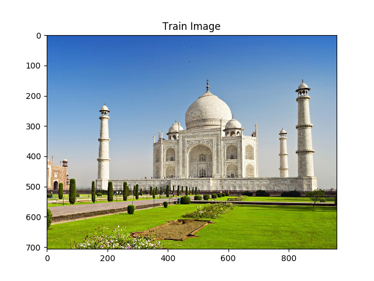
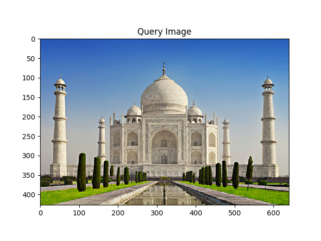
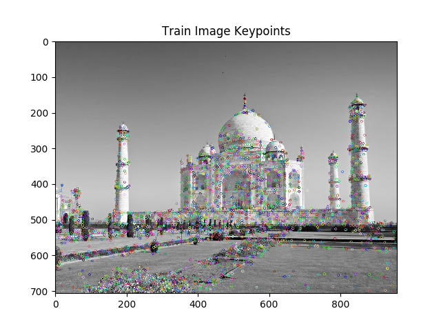
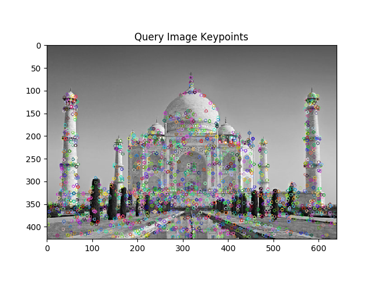
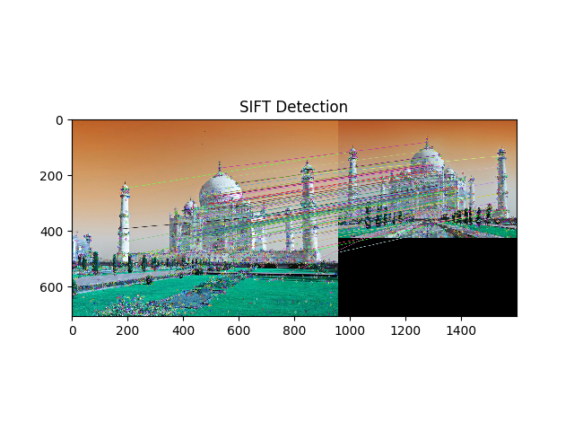

# Scale Invariant-Feature Transform (SIFT)

This repository contains implementation of Scale Invariant-Feature Transform (SIFT) algorithm in python using OpenCV.

D.Lowe proposed Scale Invariant Feature Transform (SIFT) in his paper, [Distinctive Image Features from Scale-Invariant Keypoints](https://www.cs.ubc.ca/~lowe/papers/ijcv04.pdf), which extracts keypoints and computes its descriptors. The paper also describes an approach to using these features for object recognition.

Image features extracted by SIFT are reasonably invariant to changes in the illumination image noise, rotation, scaling, and small changes in viewpoint.

There are four main stages involved in SIFT algorithm :

1. Scale-space extrema detection
2. Keypoint localization
3. Orientation Assignment
4. Keypoint descriptor

To see the stages explanation in detail see this post : [Scale Invariant-Feature Transform](https://iq.opengenus.org/p/ce788c50-8dcf-4a6b-aa2f-90c85170789c/)

NOTE : SIFT is an algorithm in “non-free” modules of OpenCV. The algorithm is patented  and while it is free to use in academic and research settings, you should technically be obtaining a license/permission if you are using them in a commercial application.

The opencv_contrib  packages contains implementations of algorithms that are either patented or in experimental development.

The algorithms and associated implementations in  opencv_contrib  are not installed by default and you need to explicitly enable them when compiling and installing OpenCV to obtain access to them. 

(The code here works with OpenCV version 3.4.2 and you need to install opencv_contrib)

## Files Description

src folder contains two files
* sift-detect.py   : real-time detection using SIFT
* sift-keypoint.py : keypoint feature matching using SIFT

res folder contains all the data required by the two files above and the ouputs.

# Ouputs

## Feature matching

  &nbsp; &nbsp; 

 

  &nbsp; &nbsp; 

 

 

## Real-Time Detection

 

 

 

